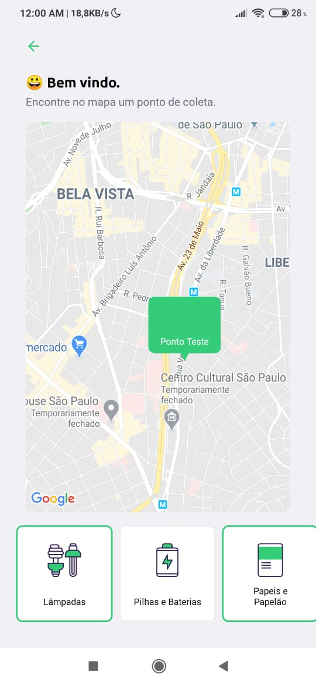
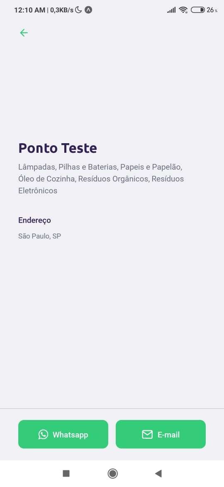
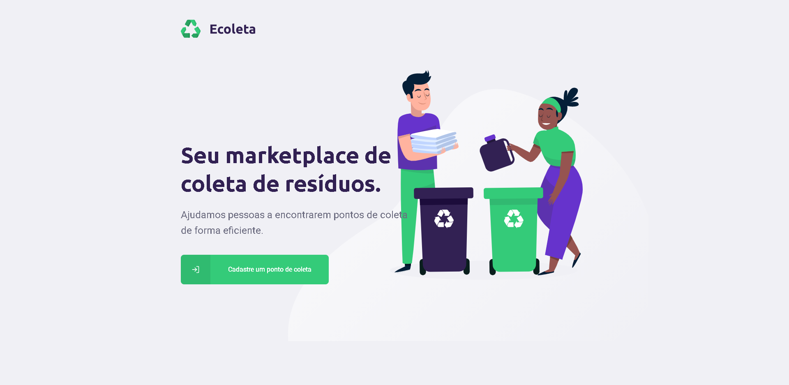
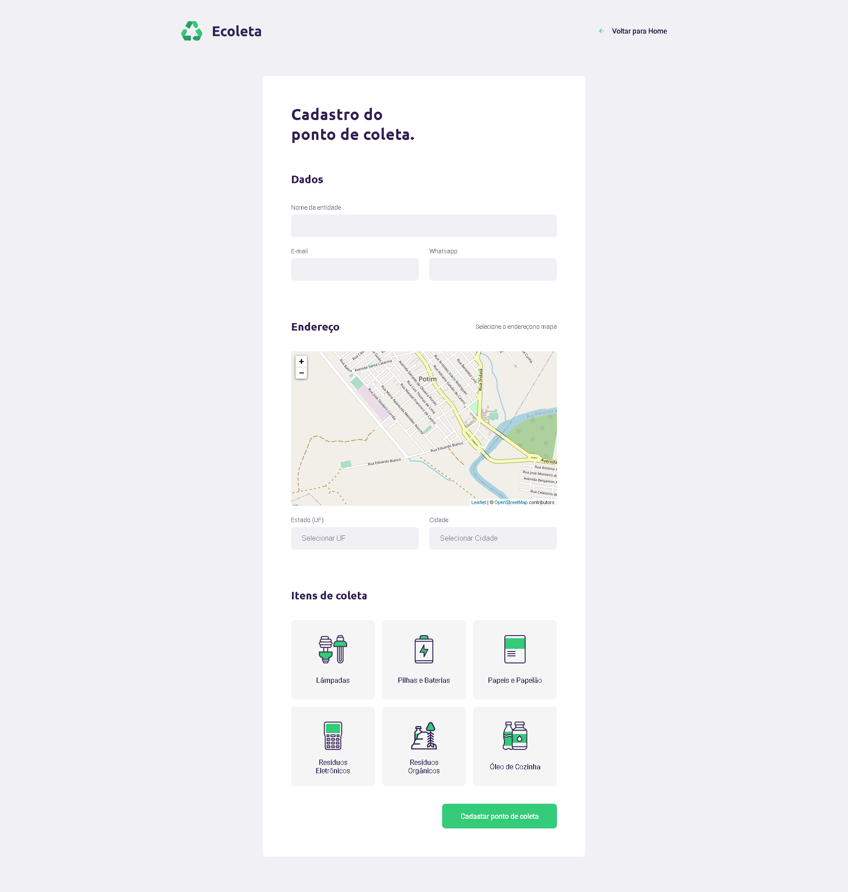

   

# NLW - Ecoleta

> Next Level Week #1 - Project made at the workshop

  
  
  

  

  

---

# :pushpin: Table of Contents

* NodeJS API :white_check_mark:
* Deno API 
* ReactJS App :white_check_mark:
* React Native App :white_check_mark:

# :postbox: Get in touch to me

**E-mail:** contato@wilsonneto.com.br

**Linkedin:** [https://www.linkedin.com/in/wilsonnetobr/](https://www.linkedin.com/in/wilsonnetobr/)

# :closed_book: License

Released in 2020.
This project is under the [MIT license](https://opensource.org/licenses/MIT).

Coded with :heart: by [Wilson Neto](https://github.com/wilsonneto-dev) 🚀
